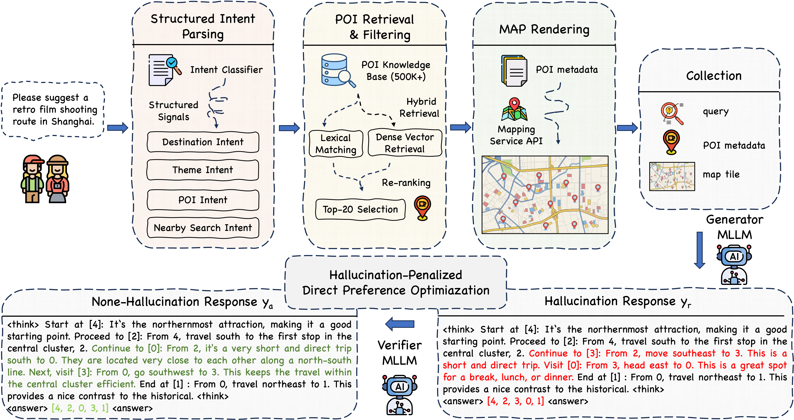

<div align="center">
  <h2 style="font-size: 36px; font-weight: bold; color: #333;">
    SMAP: Semantic Route Planning with Map-Grounded Multimodal Alignment
  </h2>
</div>


<div align="center" style="margin-top: 30px;">
  <h3 style="font-size: 24px; font-weight: bold; color: #333;">
    Wenjie Zhang<sup>1,2,* †</sup>, Chen Yang<sup>2,†</sup>, Xin Lu<sup>2</sup>, Zhen Wang<sup>2</sup>, Yue Liu<sup>2,‡</sup>, Bobo Xi<sup>1,§</sup>, Pengbo Zhang<sup>2,§</sup>
  </h3>
</div>

<!-- LOGO -->
<div align="center" style="margin-top: 20px;">
  <div>
    
    
  </div>
  <div style="margin-top: 10px; font-size: 14px; color: #666;">
    <sup>1</sup> Xidian University, China &nbsp; <sup>2</sup> Amap, Alibaba Group, China<br>
    *Work done during the internship at Amap, Alibaba Group<br> 
    †Equal contribution &nbsp; ‡Project lead &nbsp; §Corresponding authors
  </div>
</div>

<!-- LINKS -->
<div align="center" style="margin-top: 25px;">
  <a href="https://openaccess.thecvf.com/content/CVPR2026/papers/Zhang_SMAP_Semantic_Route_Planning_with_Map-Grounded_Multimodal_Alignment_CVPR_2026_paper.pdf" target="_blank">
    
  </a>
  <a href="https://cvpr.thecvf.com/media/PosterPDFs/CVPR%202026/39788.png?t=1778328849.0405874" target="_blank" style="margin-left: 10px;">
    
  </a>
</div>

---

## 📖 Framework

<div align="center" style="margin-top: 20px;">
  
</div>

<div align="center" style="margin-top: 15px;">
  <p style="font-size: 12px; font-weight: 500; color: #444;">
    Overview of the SMAP framework. (1) The user query is parsed into structured intents. (2) Candidate POIs are retrieved and filtered based on semantic relevance and spatial coherence. (3) A map tile is rendered with only the candidate POIs. (4) A generator MLLM produces a draft route, which is then verified and refined by a verifier MLLM. (5) The draft—refined pair forms a preference pair for HDPO, aligning the generator toward spatially consistent and preference-aware route generation.
  </p>
</div>

---

## 🚀 News

📢 **[2026-04-07]** SMAP is now **open-source**! Check out the repo and get started. 🔥<br>
📢 **[2026-02-21]** SMAP is accepted by **CVPR 2026 (poster)**! 🎉
---

#  🧪 Quick Start

## 📦 Environment Setup

The SMAP is built on the official [ms-swift](https://github.com/modelscope/ms-swift) framework. Please follow the official documentation to install ms-swift. 

## 🔧 Base Models

We conduct experiments based on the following pretrained models:

- [Qwen2.5-VL-7B](https://huggingface.co/Qwen/Qwen2.5-VL-7B-Instruct)
- [Qwen2.5-VL-13B](https://huggingface.co/Qwen/Qwen2.5-VL-32B-Instruct)

## 🗂️ Dataset

Our codebase includes the open-source **MM-Route** dataset:
- **Images**: Map tiles with POIs are stored in the `dataset/images/` folder
- **Queries and Retrieval Info**: User queries and corresponding retrieval information are stored in `dataset/mm-route.parquet`

## 📚 Training

Our training pipeline consists of the following steps:

1. **Answer Generation**: Use prompts in `prompts/generation/answer_generation.txt` to generate initial draft route answers
2. **Answer Refinement**: Use prompts in `prompts/generation/answer_refinement.txt` to refine the draft route answers
3. **Preference Pair Construction**: Combine draft and refined route answers to form preference pairs
4. **DPO Training**: Train using the ms-swift framework with DPO algorithm

We provide the training script in the `train` folder for easy reproduction.

We also provide ablation study prompts:
- `prompts/generation/answer_generation_fewshot.txt`: Few-shot prompts for ablation studies
- `prompts/generation/answer_generation_text_only.txt`: Text-only prompts for ablation studies

## 📊 Evaluation

For evaluation, we use LLM-as-a-Judge with 5 different metrics. The evaluation prompts are in the `prompts/evaluation/` folder.


## 📌 Citation

If you find our work helpful, please consider citing our paper:

```
@InProceedings{Zhang_2026_CVPR,
    author    = {Zhang, Wenjie and Yang, Chen and Lu, Xin and Wang, Zhen and Liu, Yue and Xi, Bobo and Zhang, Pengbo},
    title     = {SMAP: Semantic Route Planning with Map-Grounded Multimodal Alignment},
    booktitle = {Proceedings of the IEEE/CVF Conference on Computer Vision and Pattern Recognition (CVPR)},
    month     = {June},
    year      = {2026},
    pages     = {40108-40118}
}
```

Your citation helps support our research and further advances the field of semantic route planning. 🚀

---
